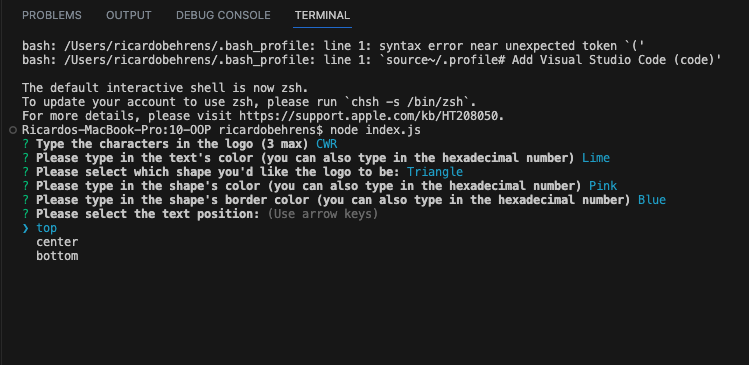
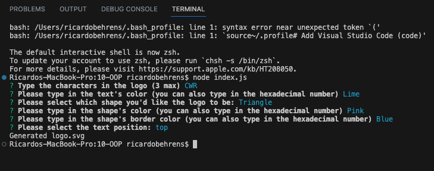
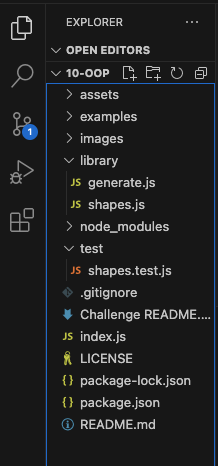
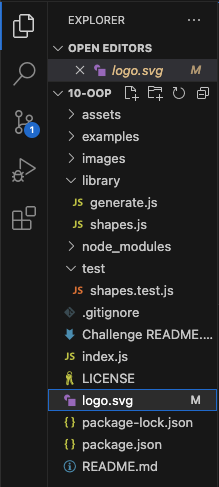
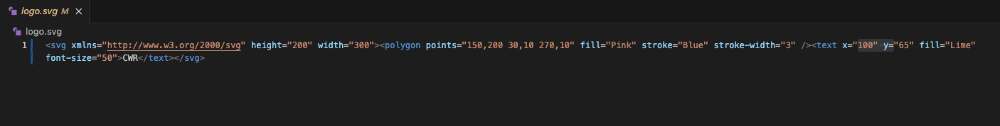
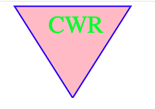

# SVG Logo Generator
[](https://opensource.org/licenses/MIT)

## Project Description
The poject's scope is to build a Node.js command-line application that takes in user input to generate a logo and save it as an SVG file. How this applicaion works is as follows:
* Once the user runs the application in Node.js, there's a series of prompts that will ask the characters (the user can input between 1 and 3 charcters).
* After this, the user will be prompted to input which color he/she would like the text to be (it can be inputted by name or by hexidecimal code).
* Following this he/she will prompted to choose which shape the user would like and what color, just as before the color can be by inputting the word or the hexidecimal code. The shape will come from a list that only has "circle", "square" and "tirangle". The user will have to use the arrow keys from the keyboard to choose which shape they require.
* After choosing the color of the shape, the user will be asked if he/she would like to input the color of the border; if the user does not require a border, he/she should input the same color of the shape.
* The last question will ask the user about the placement of the text in relation to the shape. There are 3 options and they come in a list which the user will have to pick one using the arrows in his keyboard, the same way the user selected the type of shape he/she would like for the logo.
* Finally, after all the prompts have been answered, the "logo.svg" file is generated.

## Table of Contents
- [Installation](#installation)
- [Usage](#usage)
- [License](#license)
- [Contributing](#contributing)
- [Tests](#tests)
- [Questions](#questions)
- [Screenshots](#screenshots)
  
## Installation
To install necessary dependencies, run the following command:
```
npm i
```

  
## Usage
This application will be an easy, time-saving way of generating a simple logo that can differentiate his wrok from other users via a unique logo that will be created by the user himself. The user should keep in mind that even though the logo will be unique to his color and shape selection, the logo can be easily replicated using the same selection.

  
## License
This project is licensed under the MIT license.


Copyright (c) 2023 Ricardo Behrens. All rights reserved.


Permission is hereby granted, free of charge, to any person obtaining a copy of this software and associated documentation files (the "Software"), to deal in the Software without restriction, including without limitation the rights to use, copy, modify, merge, publish, distribute, sublicense, and/or sell copies of the Software, and to permit persons to whom the Software is furnished to do so, subject to the following conditions:

The above copyright notice and this permission notice shall be included in all copies or substantial portions of the Software.

THE SOFTWARE IS PROVIDED "AS IS", WITHOUT WARRANTY OF ANY KIND, EXPRESS OR IMPLIED, INCLUDING BUT NOT LIMITED TO THE WARRANTIES OF MERCHANTABILITY, FITNESS FOR A PARTICULAR PURPOSE AND NONINFRINGEMENT. IN NO EVENT SHALL THE AUTHORS OR COPYRIGHT HOLDERS BE LIABLE FOR ANY CLAIM, DAMAGES OR OTHER LIABILITY, WHETHER IN AN ACTION OF CONTRACT, TORT OR OTHERWISE, ARISING FROM, OUT OF OR IN CONNECTION WITH THE SOFTWARE OR THE USE OR OTHER DEALINGS IN THE SOFTWARE.
  
    
## Contributing
If the user would like to add any contributions to the SVG Logo Generator, the user can contact me directly through the information in the "Questions" section of the README.

  
## Tests
Currently, there are 3 tests beign ran through 1 suite and all 3 test pass using the jest package as a dependency. To run tests, run the following command:
```
npm test
```

  
## Questions
If you have any questions about the repo, open an issue or contact me directly at [behrensricardo@gmail.com](mailto:behrensricardo@gmail.com). You can find more of my work at [rickybehrens](https://github.com/rickybehrens).

## Screenshots
<!-- Add screenshots here -->






